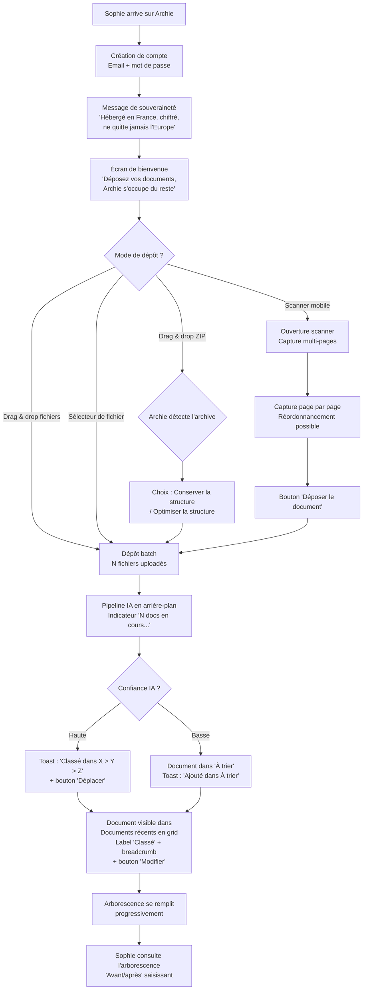
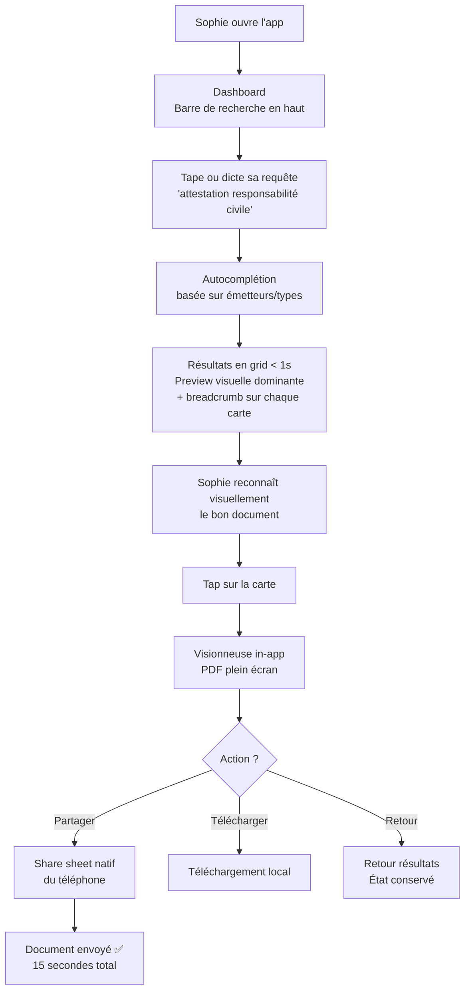
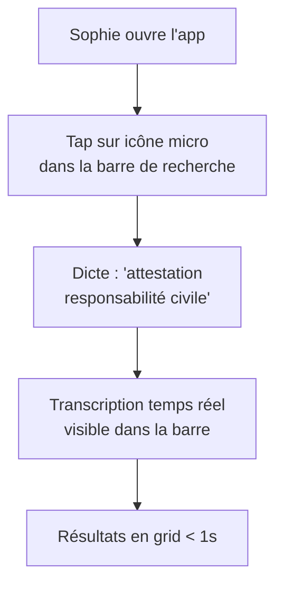
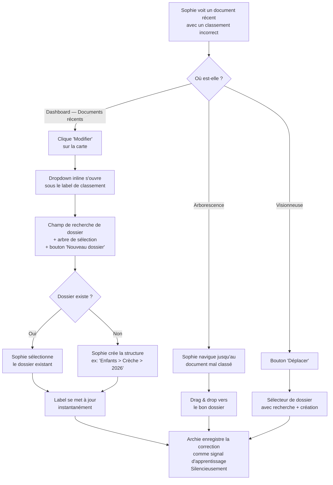
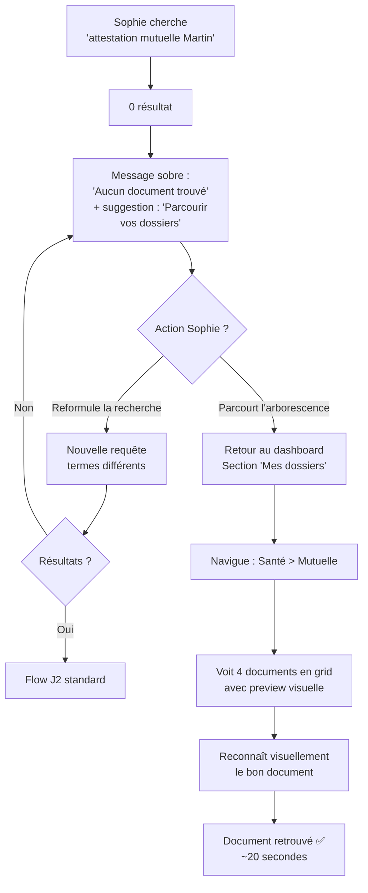
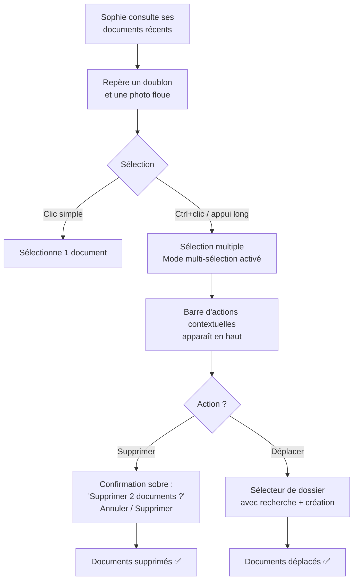

# UX Design Specification — Archie

**Author:** Antoine
**Date:** 2026-02-12

---

## Executive Summary

### Vision Produit

Archie est un coffre-fort documentaire personnel intelligent dont la promesse UX tient en trois mots : **"Balance et oublie."** L'utilisateur dépose ses documents — factures, attestations, courriers administratifs — et Archie les classe automatiquement par IA, les rendant retrouvables en langage naturel en moins d'une seconde.

Le positionnement UX : la puissance de Paperless-ngx avec la simplicité d'une app grand public. L'interface est discrète et fonctionnelle — l'outil s'efface derrière le résultat.

### Stratégie de Plateformes

**Deux horizons, un même backend :**

- **Horizon 1 — POC Web (SvelteKit)** : validation de la promesse IA. Desktop-first, upload drag & drop, classification automatique, recherche, arborescence. Le mobile web existe mais n'est pas l'expérience cible. Audience : early adopters, validation produit.

- **Horizon 2 — App Mobile Native (React Native)** : expérience d'adoption. Mobile-first, scanner multi-pages natif (détection de bords, flash, qualité d'image), ouverture instantanée, recherche immédiate, authentification biométrique. C'est cette app qui porte la promesse "zéro friction entre l'intention et le résultat". Audience : Sophie, Marie, le grand public.

**Socle commun :** NestJS + API GraphQL. Les deux clients consomment la même API. Les patterns UX sont conceptuellement transposables d'un horizon à l'autre — mêmes principes d'interaction, implémentations adaptées à chaque plateforme.

### Utilisateurs Cibles

**Sophie (persona principal)** — 38 ans, parent multi-casquettes. Usage quotidien 100% mobile : recherche urgente le matin, scan de documents au fil de l'eau. Usage desktop ponctuel pour l'onboarding massif (drag & drop batch). Pas technique, veut que "ça marche" sans rien configurer.

**Thomas (persona secondaire)** — Freelance. Usage utilitaire et ponctuel mais critique (déclarations trimestrielles, rassembler des factures). Valorise l'efficacité et la précision de la recherche.

**Marie (persona tertiaire)** — 65 ans, technophobe. Cherche "comme elle parle". A besoin d'être rassurée que ses papiers sont en sécurité. La simplicité est non-négociable.

### Défis UX

1. **Deux expériences, deux form factors** — Le POC web (desktop-first) et l'app native (mobile-first) sont des expériences distinctes qui partagent les mêmes principes mais pas les mêmes patterns. Le scanner multi-pages natif, l'ouverture instantanée et la recherche immédiate sont des enjeux spécifiques au mobile.

2. **Zéro friction à l'onboarding** — L'utilisateur doit comprendre quoi faire en 5 secondes, sans tutoriel ni configuration. Le feedback du pipeline de classement doit être lisible sans surcharger l'interface.

3. **L'IA humble sans éroder la confiance** — La file "À trier" est un signal de qualité, pas un échec. L'UX doit présenter l'incertitude de l'IA comme une preuve de fiabilité, avec un ton discret et factuel.

4. **La recherche comme surface d'interaction principale** — Sur mobile, la recherche doit être immédiatement accessible à l'ouverture de l'app. Ouvrir → taper → trouver. Trois gestes, deux secondes.

### Opportunités UX

1. **La vitesse comme émotion** — Un résultat de recherche en < 1 seconde sur mobile crée un moment "wow" viscéral. C'est le moment viral (Sophie montre Archie à Claire au parc).

2. **Souveraineté comme promesse de confiance** — Un message fort et clair au moment du premier acte de confiance (premier upload). "Vos documents sont hébergés en France, chiffrés, et ne quittent jamais l'Europe." Ensuite, discret.

3. **La sobriété qui crée la confiance** — Pas d'animations spectaculaires. L'arborescence se remplit naturellement au fil des classements. Le calme de l'interface communique la fiabilité.

4. **Le scanner natif comme différenciateur** — Un scanner multi-pages intégré de qualité (détection de bords, flash, multi-capture) sur l'app React Native transforme le téléphone en vrai outil de dématérialisation. C'est l'onboarding "vide ta pile de papiers" rendu possible.

## Core User Experience

### Expérience Définissante

Archie repose sur deux boucles d'interaction asymétriques :

**Boucle de dépôt (créer la valeur)** — L'utilisateur dépose un document, Archie fait tout le reste. Zéro décision de classement, zéro nommage, zéro tag. Le feedback de classification apparaît en temps réel ("Classé dans Factures > EDF > 2025"). Fréquence : 1 à 5 documents par semaine en régime courant, dizaines à l'onboarding.

**Boucle de recherche (révéler la valeur)** — L'utilisateur ouvre l'app, tape en langage naturel, obtient le document en < 1 seconde. C'est cette boucle qui prouve la valeur de tout le système. Fréquence plus basse, intensité émotionnelle maximale (urgence, soulagement).

**La recherche est l'interaction reine.** Le dépôt crée la valeur, la recherche la révèle. Si une seule interaction doit être parfaite, c'est celle-là.

### Stratégie de Plateforme

**POC Web (Horizon 1) — Desktop-first :**
- Upload drag & drop batch (onboarding massif)
- Classification et arborescence visibles sur grand écran
- Recherche pleinement fonctionnelle
- Mobile web fonctionnel mais non optimisé

**App React Native (Horizon 2) — Mobile-first :**
- Ouverture instantanée, recherche immédiate
- Scanner multi-pages natif (détection de bords, flash, multi-capture)
- Authentification biométrique
- Pas de mode offline (hors scope)

**Socle commun :** NestJS + API GraphQL partagée entre les deux clients.

### Interactions Sans Friction

**Ce qui doit être invisible :**
- La classification — l'utilisateur ne décide jamais où ranger un document. Il dépose, Archie classe. La seule action de classement est la correction par déplacement.
- Le chiffrement — la sécurité opère en coulisses, jamais dans le chemin utilisateur
- L'apprentissage — déplacer un document corrige l'IA sans formulaire ni confirmation

**Ce qui doit être immédiat :**
- La recherche — résultat affiché en < 1 seconde
- L'ouverture de l'app mobile — de l'icône au champ de recherche en < 2 secondes
- Le feedback de classement — toast temporaire après classification : "Classé dans Factures > EDF > 2025" avec bouton "Déplacer" pour correction immédiate. En batch, pas de toast : les documents récemment classés apparaissent dans le dashboard, corrigeables au rythme de l'utilisateur.

**Ce qui doit être évident :**
- Le dépôt — un bouton "+" visible, accès au scanner en un tap
- La navigation — switch fluide entre dashboard (documents récents) et vue arborescence
- Le fallback — quand la recherche ne trouve pas, l'arborescence est accessible immédiatement

### Canaux de Dépôt MVP

| Canal | Plateforme | Détail |
|---|---|---|
| Drag & drop (fichiers) | Web desktop | Un ou plusieurs fichiers |
| Drag & drop (ZIP structuré) | Web desktop | Archive ZIP avec choix de traitement de la structure |
| Sélecteur de fichier | Web + mobile | Sélection classique |
| Scanner multi-pages | App React Native | Capture multi-pages native (détection de bords, flash) |

**Import ZIP structuré :** L'utilisateur dépose un fichier .zip contenant des documents organisés en dossiers. Après le dépôt, Archie propose deux options :

- **"Conserver la structure"** — L'arborescence du zip est reprise telle quelle. Les dossiers deviennent les dossiers dans Archie. L'IA n'intervient pas sur le classement.
- **"Optimiser la structure"** — L'arborescence sert d'indice mais l'IA peut réorganiser certains documents si elle détecte un meilleur classement. Les documents ambigus vont dans "À trier".

Les fichiers à la racine du zip suivent le parcours de classification automatique standard dans les deux modes. Ce canal facilite la migration depuis un archivage existant (dossiers locaux, exports d'autres outils, téléchargements cloud).

### Intelligence de Classification

La classification repose sur trois couches de signaux complémentaires :

1. **Contenu textuel** — Entités extraites par l'IA (émetteur, type de document, date, personne, montant) à partir du texte OCR.

2. **Empreinte visuelle** — Signature de la mise en page, des logos et de la structure graphique du document. Permet de détecter la proximité entre documents visuellement similaires (même émetteur, même charte graphique). Exemple : une facture Orange et un contrat Orange partagent la même empreinte visuelle (logo, header, disposition), ce qui les regroupe par émetteur avant même l'analyse du contenu.

3. **Similarité documentaire** — Comparaison sémantique avec les documents existants de l'utilisateur. Plus la base grandit, plus la classification s'affine.

**Hiérarchie de classement :** L'empreinte visuelle identifie la source (qui), le contenu textuel identifie le type (quoi), la similarité documentaire affine le placement dans l'arborescence (où).

**Impact UX :** Ces trois couches combinées réduisent le taux de documents dans "À trier" et accélèrent le cercle vertueux de l'onboarding — chaque document déposé améliore le classement des suivants.

### Moments Critiques de Succès

1. **Le premier upload** — Sophie dépose son premier document. Archie le classe en < 20 secondes. Le toast apparaît : "Classé dans Énergie > EDF > 2025". Sophie n'a rien fait. C'est le moment où la promesse "balance et oublie" devient tangible. Si ce moment rate, Sophie ne revient pas.

2. **La première recherche réussie** — Sophie tape "attestation assurance" et le document apparaît en 0.7 seconde avec une preview. C'est le moment "wow". C'est aussi le moment viral (démontrable en 5 secondes à quelqu'un d'autre).

3. **L'onboarding "avant/après"** — Sophie a déposé 50+ documents. L'arborescence montre une base organisée là où il y avait un tiroir en vrac. La transformation visuelle valide l'investissement initial.

4. **La première correction** — L'IA a mal classé un document. Sophie le déplace dans le bon dossier. Pas de formulaire, pas de confirmation. Le déplacement EST la correction. Si ce geste est fluide, Sophie garde confiance. Si c'est laborieux, elle doute du système.

5. **Le message de souveraineté** — Au moment du premier upload, avant que Sophie ne confie ses documents : "Vos documents sont hébergés en France, chiffrés, et ne quittent jamais l'Europe." C'est l'acte de confiance qui déverrouille tout le reste.

### Principes d'Expérience

1. **Recherche d'abord** — La barre de recherche est l'élément dominant de l'interface. L'écran d'accueil présente la recherche en haut et les documents récents en dessous. Tout chemin mène à la recherche.

2. **Zéro décision de classement** — L'utilisateur ne choisit jamais où ranger un document. Il dépose, Archie classe. La seule action de classement possible est la correction par déplacement.

3. **Feedback silencieux, jamais intrusif** — Le ton est discret et fonctionnel. Le feedback de classement informe sans interrompre (toast temporaire avec option de correction). Pas de modales, pas de célébrations, pas d'animations. Le calme de l'interface est une feature.

4. **L'arborescence comme filet de sécurité** — L'arborescence n'est pas le mode de navigation principal (c'est la recherche), mais elle est toujours accessible en un geste depuis le dashboard. Elle sert la confiance : l'audit visuel que "tout est bien rangé" et le fallback quand la recherche ne suffit pas.

5. **Un seul moment de réassurance** — Le message de souveraineté et de sécurité intervient une fois, au bon moment (premier upload), avec force et clarté. Ensuite, l'interface ne rappelle plus ce qui est acquis.

## Desired Emotional Response

### Objectif Émotionnel Principal

**Sérénité administrative.** L'utilisateur doit ressentir que ses documents sont sous contrôle sans y penser. Archie ne génère pas d'excitation ni de surprise — il génère l'absence d'inquiétude. Le sentiment cible : "Mes papiers sont rangés, je les retrouverai quand j'en aurai besoin."

### Cartographie Émotionnelle par Moment

| Moment | Émotion visée | Ce que l'utilisateur se dit |
|---|---|---|
| Découverte / inscription | Curiosité sobre | "C'est simple, je vais essayer" |
| Message de souveraineté (premier upload) | Réassurance | "OK, mes documents sont en sécurité" |
| Premier document classé automatiquement | Soulagement discret | "Je n'ai rien eu à faire" |
| Onboarding massif terminé (50+ docs) | Émerveillement calme | "Pourquoi j'ai pas eu ça avant" |
| Recherche réussie en < 1s | Soulagement instantané | "Archie me sauve la mise" |
| L'IA se trompe, correction en un geste | Contrôle | "C'est MON espace, je décide" |
| Recherche échoue, fallback arborescence | Confiance maintenue | "Je retrouve quand même" |
| Montrer Archie à quelqu'un | Fierté discrète | "Regarde ce que j'ai trouvé" |
| 50ème ouverture de l'app | Confiance routinière | "Mon outil fiable" |

### Micro-Émotions Critiques

**À cultiver :**
- **Contrôle** — L'utilisateur est maître de son espace. L'IA aide, l'utilisateur décide. Chaque correction est fluide, chaque déplacement est respecté.
- **Confiance** — Le système est prévisible. L'arborescence ne bouge pas entre deux visites. Les documents sont là où on les a mis ou où Archie les a classés.
- **Compétence** — L'utilisateur se sent efficace. Retrouver un document en 5 secondes au lieu de 5 minutes, c'est se sentir organisé sans avoir fourni l'effort.

**À éviter :**
- **Frustration** — Si la correction d'un classement prend plus de 2 gestes, on a échoué.
- **Méfiance** — Si l'utilisateur commence à vérifier systématiquement chaque classement, la promesse "balance et oublie" est morte.
- **Surcharge cognitive** — Si l'interface demande une décision, un choix, une configuration, on a trahi le principe de sérénité.
- **Infantilisation** — Pas de tutoriels forcés, pas de "Bravo !", pas de gamification. Le ton est adulte, factuel, respectueux.

### Implications Design

| Émotion visée | Choix UX qui la soutient |
|---|---|
| Sérénité | Interface calme, sans animations, couleurs neutres, espaces généreux. Pas de notifications inutiles. |
| Contrôle | Toast de classement avec bouton "Déplacer". Arborescence accessible en un geste. Suppression immédiate sans confirmation modale. |
| Confiance | Arborescence stable entre les visites. Feedback de classement factuel ("Classé dans X") sans emphase. Message souveraineté au bon moment. |
| Confiance routinière | L'app s'ouvre exactement comme la dernière fois. Pas de "quoi de neuf", pas de changelog forcé. La recherche est là, prête. |
| Compétence | Résultat de recherche en < 1s. Preview inline immédiate. Pas d'étapes intermédiaires entre l'intention et le résultat. |

### Principes de Design Émotionnel

1. **Le calme est une feature** — Chaque élément visuel qui n'est pas nécessaire est du bruit. L'interface respire. Le blanc domine. Les actions sont évidentes mais jamais criardes.

2. **L'IA s'efface** — L'utilisateur ne doit jamais se sentir "géré par une IA". Pas de mascotte, pas de messages anthropomorphiques, pas de "J'ai classé votre document !". Le feedback est factuel : "Classé dans Factures > EDF > 2025". Point.

3. **L'erreur est normale** — Quand l'IA se trompe, l'interface ne s'excuse pas et ne dramatise pas. Le document est dans "À trier" ou mal classé, l'utilisateur le déplace, c'est terminé. La correction est un geste naturel, pas un événement.

4. **La routine est le succès** — Le signe que l'UX fonctionne, c'est que l'utilisateur n'y pense plus. Archie ne cherche pas à être mémorable à chaque usage. Il cherche à être invisible et fiable, comme un bon classeur physique qui serait intelligent.

## UX Pattern Analysis & Inspiration

### Produits de Référence

**Google Drive — Navigation arborescente**
- Pattern à reproduire : navigation fichiers/dossiers universellement comprise. Breadcrumb, liste de fichiers avec icônes, actions contextuelles.
- Force : tout le monde sait naviguer dans Google Drive. Zéro apprentissage.
- Nuance clé : dans Google Drive, l'utilisateur reconnaît SON organisation. Dans Archie, il découvre une organisation générée par l'IA. Le pattern de navigation est le même, mais le moment de découverte (onboarding) nécessite des indices visuels discrets (ex: nombre de documents par dossier) pour que l'utilisateur comprenne d'où vient la structure.

**Alan — Intuitivité grand public**
- Pattern à reproduire : interface épurée, langage simple, parcours guidé sans friction. Chaque écran a un objectif clair.
- Force : un sujet complexe (assurance santé) rendu intuitif pour le grand public. Même enjeu pour Archie avec la gestion documentaire.
- À retenir : ton factuel et bienveillant sans être infantilisant.

**Adobe Scan — Scanner mobile**
- Pattern à reproduire : détection automatique des bords, flash intelligent, capture multi-pages, qualité d'image optimisée.
- À adapter : dans Archie, le scan est intégré au flux de dépôt — scanner → document créé → classé automatiquement. Pas d'étape intermédiaire d'export.

**Google Search — Recherche minimaliste**
- Pattern à reproduire : une barre de recherche, des résultats pertinents, fin de l'histoire. Zéro syntaxe, zéro filtre obligatoire.
- À retenir : la vitesse perçue est aussi importante que la vitesse réelle. Suggestions et autocomplétion contribuent au sentiment d'instantanéité.

### Patterns UX Transférables

| Pattern | Source | Application dans Archie |
|---|---|---|
| Arborescence fichiers/dossiers | Google Drive | Vue arborescence depuis le dashboard, breadcrumb, actions contextuelles |
| Barre de recherche unique | Google Search | Élément dominant de l'écran d'accueil, résultats < 1s, preview inline |
| Interface épurée sans jargon | Alan | Ton factuel, parcours évidents, zéro terminologie technique |
| Scanner multi-pages natif | Adobe Scan | Détection de bords, flash, multi-capture intégrés au flux de dépôt |
| Suggestions de recherche | Google Search | Autocomplétion basée sur les documents existants (émetteurs, types) |
| Recherche vocale native | Assistants vocaux | Speech-to-text dans la barre de recherche, transcription temps réel visible |
| Voice shortcut système | Siri / Google Assistant | "Archie, trouve moi mon ordonnance" → l'app s'ouvre sur les résultats |
| Recherche système | Spotlight / Android | Documents Archie indexés dans la recherche native du téléphone |

### Niveaux de Recherche (Roadmap)

| Niveau | Interaction | Friction | Phase |
|---|---|---|---|
| 1 | Barre de recherche texte | Ouvrir l'app → taper → trouver | MVP (Web + Mobile) |
| 2 | Speech-to-text in-app | Ouvrir l'app → parler → trouver | MVP Mobile |
| 3 | Siri / Google Assistant shortcut | "Archie, trouve moi..." → résultats | Post-MVP Mobile |
| 4 | Spotlight / recherche système | Chercher dans le téléphone → docs Archie apparaissent | Post-MVP Mobile |

Chaque niveau réduit la friction. Le niveau 4 est la disparition totale de l'interface — Archie devient un service du téléphone, pas une app à ouvrir. L'architecture de recherche (query par URL paramétrée) doit supporter tous les niveaux dès le MVP.

### Rampe de Compétence — Organisation

L'organisation dans Archie est une rampe à trois niveaux, pas un choix binaire :

1. **Automatique (défaut)** — L'IA classe, l'utilisateur ne fait rien. Cible : masse des utilisateurs (Sophie, Marie).
2. **Ajustable (correction)** — L'utilisateur déplace un document mal classé. Le geste est la correction. Cible : utilisateurs engagés.
3. **Structurable (manuel)** — L'utilisateur crée des dossiers, restructure l'arborescence. Parcours secondaire pour garder le contrôle. Cible : power users (Thomas).

L'organisation manuelle n'est jamais requise, toujours possible.

### Anti-Patterns à Éviter

1. **L'organisation manuelle comme seule option** — Le défaut de tous les outils documentaires traditionnels. Archie élimine cette obligation. L'organisation manuelle reste possible comme parcours secondaire pour garder le contrôle, mais elle n'est jamais requise.

2. **La surcharge de fonctionnalités** — Les apps documentaires qui ajoutent édition, annotation, collaboration, OCR manuel, tags, filtres avancés. Archie fait trois choses : stocker, classer, retrouver.

3. **Le feedback anxiogène** — Les barres de progression détaillées ("OCR en cours... Extraction... Embedding..."). Un état suffit : "en cours" → "classé".

4. **Les filtres obligatoires** — Les interfaces de recherche qui forcent des critères avant de chercher. Archie est une barre unique. Les filtres avancés, s'ils existent, sont optionnels.

### Stratégie d'Inspiration

**Adopter tel quel :**
- Navigation arborescente façon Google Drive (pattern universel)
- Barre de recherche unique façon Google Search (modèle mental établi)
- Qualité de scan façon Adobe Scan (barre de référence mobile)
- Recherche vocale sur l'app mobile (speech-to-text natif)

**Adapter :**
- Épure d'Alan → appliquée à un contexte documentaire. Même principe de simplicité, vocabulaire différent.
- Suggestions Google → autocomplétion basée sur les émetteurs et types de documents de l'utilisateur.
- Voice shortcut (Siri/Google Assistant) → l'app s'ouvre sur l'écran de recherche avec query pré-remplie et résultats affichés (pas directement sur un document, pour permettre l'ajustement).

**Refuser :**
- Tout ce qui ressemble à de l'organisation obligatoire
- Tout ce qui expose la complexité du pipeline IA
- Tout ce qui ajoute des étapes entre l'intention et le résultat

## Design System Foundation

### Choix du Design System

**Approche : Système thémable unifié via Tailwind CSS**

Un seul univers visuel, deux implémentations adaptées à chaque plateforme, liées par un fichier de configuration Tailwind partagé.

| Plateforme | Composants | Styling | Primitives accessibles |
|---|---|---|---|
| Web (SvelteKit) | shadcn-svelte | Tailwind CSS | bits-ui |
| Mobile (React Native) | react-native-reusables | NativeWind | React Native primitives |
| **Partagé** | — | **tailwind.config commun** | — |

### Rationale

1. **Cohérence visuelle garantie** — Les design tokens (couleurs, espacements, typographie, border-radius, shadows) sont définis une seule fois dans le `tailwind.config` partagé. Un composant web et son équivalent mobile sont visuellement identiques.

2. **Sobriété native** — shadcn et react-native-reusables sont des composants non-opinionés. Pas de style Material Design imposé, pas de surcharge visuelle. Le ton "discret et fonctionnel" est le comportement par défaut, pas un override.

3. **Accessibilité intégrée** — bits-ui (web) fournit les comportements accessibles WCAG 2.1 AA (focus, ARIA, navigation clavier). React Native fournit les primitives d'accessibilité natives (VoiceOver, TalkBack).

4. **Dev solo viable** — Les composants sont copiés dans le projet (pas de dépendance npm opaque). Le développeur comprend et contrôle chaque composant. La courbe d'apprentissage est faible car le langage (Tailwind) est le même sur les deux plateformes.

### Stratégie d'Implémentation

**Phase 1 — POC Web :**
- Installer shadcn-svelte + Tailwind CSS
- Définir les design tokens dans `tailwind.config` : palette de couleurs (neutres, accent sobre), typographie, espacements
- Construire les composants UI de base : barre de recherche, carte document, arborescence, toast, boutons

**Phase 2 — App React Native :**
- Installer NativeWind + react-native-reusables
- Importer le même `tailwind.config` (ou les mêmes tokens)
- Reconstruire les composants clés en React Native avec la même identité visuelle
- Adapter les patterns d'interaction au mobile natif (gestes, haptic feedback, scanner)

### Stratégie de Personnalisation

**Design tokens à définir :**
- **Palette** — Couleurs neutres dominantes (interface calme), une couleur d'accent sobre pour les actions principales et le feedback de classement
- **Typographie** — Police sans-serif lisible, hiérarchie claire (titre, corps, caption). Tailles optimisées pour la lecture mobile.
- **Espacements** — Généreux. L'interface respire. Cohérent avec le principe "le calme est une feature".
- **Border-radius** — Arrondis doux, modernes, cohérents sur tous les composants.
- **Shadows** — Minimales. Pas d'effets de profondeur marqués. La hiérarchie se fait par l'espacement et la typographie, pas par les ombres.

**Composants custom à prévoir :**
- Barre de recherche (avec icône micro pour speech-to-text)
- Carte document (thumbnail + métadonnées + preview)
- Arborescence de dossiers (style Google Drive)
- Toast de classement (avec bouton "Déplacer")
- Scanner multi-pages (React Native uniquement)
- Indicateur de pipeline ("en cours" → "classé")

## Expérience Définissante

### En Une Phrase

> "Dépose tes papiers, retrouve-les en une seconde."

C'est ce que Sophie dit à Claire au parc. C'est la phrase qu'un utilisateur écrit dans un avis. C'est la promesse testable en 5 secondes.

### Modèle Mental de l'Utilisateur

Sophie ne pense pas en termes de pipeline IA. Son modèle mental :

- **Archie = un tiroir magique.** Tu mets des papiers dedans, ils se rangent tout seuls, et tu les retrouves en demandant.
- **La recherche = demander à quelqu'un qui sait.** "Tu sais où est l'attestation d'assurance ?" → "La voilà." Le langage naturel est le mode d'interaction attendu.
- **L'arborescence = ouvrir le tiroir pour vérifier.** Pas le mode de recherche principal, mais l'audit visuel que tout est bien rangé.

Les utilisateurs existants de Google Drive, Dropbox, ou du Finder arrivent avec un modèle "je range moi-même". Archie doit **désapprendre** ce réflexe dès l'onboarding : le premier document classé automatiquement est la preuve que ranger n'est plus leur travail.

### Critères de Succès de l'Expérience Cœur

| Critère | Seuil de succès | Seuil d'échec |
|---|---|---|
| Recherche → résultat pertinent | < 1 seconde | > 3 secondes |
| Reconnaissance visuelle du document | Preview thumbnail suffisante | Obligation d'ouvrir pour identifier |
| Dépôt → feedback de classement | < 20 secondes | > 60 secondes |
| Correction d'un classement | ≤ 2 gestes (déplacer) | Formulaire ou confirmation modale |
| Compréhension de l'interface (1ère visite) | < 5 secondes | Besoin d'un tutoriel |

### Patterns : Familier Réassemblé

Archie n'invente aucun pattern d'interaction. Il **combine des patterns établis** de manière nouvelle :

| Pattern | Source familière | Usage dans Archie |
|---|---|---|
| Barre de recherche unique | Google Search | Recherche de documents |
| Arborescence fichiers/dossiers | Google Drive | Navigation et audit visuel |
| Drag & drop pour déplacer | Finder / Google Drive | Correction de classement |
| Scanner multi-pages | Adobe Scan | Dépôt mobile |
| Toast notification | Apps mobiles modernes | Feedback de classement |
| Speech-to-text | Assistants vocaux | Recherche mains libres |

**L'innovation n'est pas dans l'interaction, elle est dans l'automatisation.** L'utilisateur retrouve des gestes qu'il connaît, mais le travail d'organisation a disparu.

### Mécaniques — Flux de Recherche (Interaction Reine)

**1. Initiation :**
- L'app s'ouvre sur le dashboard. La barre de recherche est en haut, toujours visible, toujours prête.
- Sur mobile : icône micro intégrée dans la barre pour le speech-to-text.
- Post-MVP mobile : invocable par voice shortcut Siri/Google Assistant sans ouvrir l'app.

**2. Interaction :**
- L'utilisateur tape (ou dicte) sa requête en langage naturel.
- Autocomplétion basée sur les émetteurs, types de documents et termes fréquents de l'utilisateur.
- En mode vocal : la transcription s'affiche en temps réel dans la barre (feedback visuel immédiat).

**3. Résultats :**
- Affichés en < 1 seconde.
- Chaque résultat est une card avec **preview visuelle dominante** (thumbnail de la première page du document) + titre + dossier de classement + date.
- Les thumbnails sont chiffrés at-rest et déchiffrés à la volée lors de l'affichage — jamais de PNG en clair sur le serveur.
- L'utilisateur reconnaît visuellement le bon document sans l'ouvrir.

**4. Ouverture :**
- Tap sur un résultat → le document s'ouvre en plein écran dans une **visionneuse intégrée** (PDF viewer in-app). Pas de rupture de contexte, pas de sortie de l'app.
- Boutons "Télécharger" et "Partager" pour exporter si besoin.
- Bouton retour → retour aux résultats de recherche (état conservé).

### Mécaniques — Flux de Dépôt

**Dépôt unitaire (mobile quotidien) :**
1. Bouton "+" visible → accès au scanner ou sélecteur de fichier
2. Capture (scanner multi-pages) ou sélection du fichier
3. Upload → pipeline IA en arrière-plan
4. Toast : "Classé dans Factures > EDF > 2025" + bouton "Déplacer"
5. Si faible confiance : le document va dans "À trier"

**Dépôt batch (desktop onboarding) :**
1. Drag & drop de plusieurs fichiers sur la zone de dépôt
2. Upload simultané → pipeline parallèle
3. Pas de toast unitaire — les documents classés apparaissent dans le dashboard avec leur classement affiché
4. L'utilisateur corrige à son rythme

**Dépôt ZIP structuré :**
1. Drag & drop du fichier .zip
2. Archie propose : "Conserver la structure" / "Optimiser la structure"
3. Traitement selon le choix → documents classés selon l'arborescence du zip ou reclassés par l'IA

### Mécaniques — Flux de Correction

1. L'utilisateur identifie un document mal classé (via dashboard, arborescence, ou résultat de recherche)
2. Il déplace le document vers le bon dossier (drag & drop sur desktop, action contextuelle sur mobile)
3. Archie enregistre le déplacement comme signal d'apprentissage — silencieusement, sans confirmation
4. Le document est dans son nouveau dossier. Terminé.

**Pas de formulaire, pas de "Êtes-vous sûr ?", pas de notification "L'IA a appris de votre correction".** Le geste est naturel et immédiat.

## Visual Design Foundation

### Système de Couleurs

**Direction : Indigo Doux** — Modernité sobre, intelligence discrète. L'accent indigo intervient avec parcimonie sur les éléments d'interaction. Le reste de l'interface est neutre et calme.

**Palette principale :**

| Rôle | Couleur | Usage |
|---|---|---|
| Fond principal | `white` / `gray-50` | Arrière-plan de l'app |
| Fond secondaire | `gray-100` | Cards, zones de dépôt, sidebar |
| Texte principal | `gray-900` | Titres, corps de texte |
| Texte secondaire | `gray-500` | Labels, métadonnées, timestamps |
| Bordures | `gray-200` | Séparateurs, contours de cards |
| Accent principal | `indigo-500` (~`#6366F1`) | Boutons principaux, liens, éléments actifs |
| Accent hover | `indigo-600` | États hover et focus |
| Accent léger | `indigo-50` / `indigo-100` | Fond des éléments sélectionnés, badges |

**Couleurs sémantiques :**

| Rôle | Couleur | Usage |
|---|---|---|
| Succès | `emerald-600` | Toast "Classé dans...", confirmation |
| Avertissement | `amber-500` | Documents dans "À trier" |
| Erreur | `red-600` | Échecs d'upload, erreurs de validation |
| Info | `indigo-500` | Indicateurs neutres, liens |

**Règle d'utilisation :** L'indigo est réservé aux éléments interactifs et aux indicateurs d'état. L'interface au repos est monochromatique (blancs et gris). L'accent indigo apparaît quand l'utilisateur agit ou quand le système communique un résultat. Jamais de couleurs vives en arrière-plan.

### Système Typographique

**Police : Inter** — Sans-serif moderne, optimisée pour les écrans, excellente lisibilité en petite taille (idéal mobile). Gratuite, open-source, supporte tous les caractères français.

**Échelle typographique :**

| Niveau | Taille | Poids | Usage |
|---|---|---|---|
| H1 | 24px / 1.5rem | Semibold (600) | Titre de page (rare) |
| H2 | 20px / 1.25rem | Semibold (600) | Titres de section |
| H3 | 16px / 1rem | Medium (500) | Sous-titres, noms de dossiers |
| Body | 14px / 0.875rem | Regular (400) | Texte courant, résultats de recherche |
| Caption | 12px / 0.75rem | Regular (400) | Métadonnées, dates, labels secondaires |

**Line height :** 1.5 pour le corps, 1.3 pour les titres.

**Principes typographiques :**
- La hiérarchie se fait par le poids et la taille, jamais par la couleur de l'accent (sauf liens).
- Pas de texte en majuscules sauf les acronymes.
- Pas de texte en italique dans l'interface (réservé au contenu des documents).

### Espacements & Layout

**Unité de base : 4px** — Tous les espacements sont des multiples de 4px. Progression : 4, 8, 12, 16, 24, 32, 48, 64.

**Espacement entre composants :**

| Contexte | Espacement |
|---|---|
| Entre éléments dans une card | 8px |
| Entre cards dans une liste | 12px |
| Padding interne d'une card | 16px |
| Entre sections de page | 32px |
| Marges latérales (mobile) | 16px |
| Marges latérales (desktop) | 24-32px |

**Grille :**
- **Mobile** : colonne unique, pleine largeur
- **Desktop** : sidebar fixe (arborescence, 280px) + zone principale fluide
- Largeur maximale du contenu : 960px (centré sur grands écrans)

**Principes de layout :**
1. **L'espace vide est intentionnel** — Chaque zone de respiration contribue au calme de l'interface. Pas de compaction.
2. **Le contenu drive le layout** — Les cards de documents s'adaptent au contenu (thumbnail + métadonnées), pas l'inverse.
3. **Mobile = empilé, desktop = côte à côte** — La sidebar (arborescence) est un panneau latéral sur desktop, un écran dédié sur mobile (switch depuis le dashboard).

### Accessibilité Visuelle

**Contraste :**
- Texte principal (`gray-900`) sur fond blanc : ratio > 15:1 (largement au-dessus du WCAG AA 4.5:1)
- Texte secondaire (`gray-500`) sur fond blanc : ratio ~5.5:1 (conforme WCAG AA)
- Accent indigo (`indigo-500`) sur fond blanc : ratio ~4.5:1 (limite WCAG AA — à valider, utiliser `indigo-600` si insuffisant pour le texte)
- Accent indigo sur fond `indigo-50` : à vérifier (badges, éléments sélectionnés)

**Focus visible :**
- Outline `indigo-500` de 2px sur tous les éléments interactifs au focus clavier
- Jamais de suppression du focus ring (`outline: none` interdit)

**Cibles tactiles :**
- Minimum 44x44px sur mobile (conformité WCAG 2.1 AA)
- Espacement minimum de 8px entre cibles tactiles adjacentes

## Design Direction Decision

### Directions de Design Explorées

Un fichier HTML interactif (`ux-design-directions.html`) a été généré avec 8 sections de mockup couvrant : Dashboard, Résultats de recherche, Arborescence, Toast/Feedback, Visionneuse, Onboarding, Mobile et Scanner. L'exploration a permis de confronter les choix théoriques (étapes 1-8) à une représentation visuelle concrète et d'identifier les ajustements nécessaires.

### Direction Choisie

**Direction unique validée avec ajustements.** Pas de choix entre variantes — la direction Indigo Doux avec les principes "discret et fonctionnel" est confirmée. L'exploration a surtout affiné les choix de layout et d'interaction.

### Ajustements Clés Issus de l'Exploration

**1. Layout du Dashboard — Pas de sidebar**

L'arborescence n'est pas dans une sidebar latérale. Le contenu principal de la page suit le modèle Google Drive : barre de recherche en haut → section "Documents récents" → liste des dossiers (à la racine). L'arborescence est le corps de la page, pas un panneau latéral.

**2. Affichage Grid/Card exclusif**

Tous les documents sont présentés en format grid/cartes. La vue en liste ligne par ligne est supprimée. Que ce soit dans les résultats de recherche, les documents récents, ou l'arborescence — toujours des cartes en grille.

**3. Labels de statut sur les documents récents**

Chaque carte dans la section "Documents récents" affiche un label de statut : "Classé dans [dossier]" ou "À trier". Ce feedback visuel immédiat permet de savoir où le document a été rangé sans naviguer.

**4. Bouton "Modifier" — Documents récents uniquement**

Un bouton "Modifier" apparaît sur chaque carte de la section "Documents récents" pour permettre la correction immédiate du classement. Ce bouton n'apparaît pas sur les documents affichés ailleurs (arborescence, résultats de recherche) — la correction hors contexte récent se fait par drag & drop ou menu contextuel.

**5. Breadcrumb de localisation hors arborescence**

Chaque carte de document affichée hors de son contexte arborescent (documents récents, résultats de recherche) inclut un breadcrumb indiquant son emplacement (ex: "Factures › EDF › 2025"). Donne le "où" en un coup d'œil.

**6. Interactions de gestion de fichiers**

- Drag & drop pour déplacer fichiers et dossiers
- Ctrl+C / Ctrl+V pour copier-coller
- Sélection multiple pour actions de masse (déplacer, supprimer, etc.)

Ces interactions sont alignées avec le modèle mental Google Drive — zéro courbe d'apprentissage.

**7. Iconographie — Lucide Icons**

Toutes les icônes de l'interface utilisent la bibliothèque Lucide Icons. Sobre, cohérent, aligné avec l'esprit "discret et fonctionnel". Lucide est le choix par défaut de shadcn-svelte, naturel dans l'écosystème.

**8. Scanner — Réordonnancement des pages validé**

La fonctionnalité de réordonnancement des pages dans le scanner multi-pages est confirmée. L'utilisateur peut réorganiser l'ordre des pages capturées avant de finaliser le document.

### Design Rationale

La direction choisie repose sur un principe central : **l'interface reproduit des patterns universellement compris** (Google Drive, Google Search) en y injectant l'automatisation IA. Aucun pattern d'interaction n'est inventé — l'innovation est dans ce que l'utilisateur n'a plus à faire.

Le choix du grid/card exclusif et la suppression de la sidebar reflètent la volonté de simplicité et de lisibilité visuelle. Le bouton "Modifier" limité aux documents récents respecte le principe de feedback contextuel : la correction n'a de sens que quand le classement est frais.

### Approche d'Implémentation

**Composants clés à construire :**

| Composant | Caractéristiques |
|---|---|
| SearchBar | Barre de recherche sticky en haut, icône micro (mobile), autocomplétion |
| DocumentCard | Thumbnail + titre + breadcrumb + date + label statut (si récent) + bouton "Modifier" (si récent) |
| FolderCard | Icône Lucide folder + nom + compteur de documents |
| FolderGrid | Grille de dossiers responsive |
| RecentSection | Section "Documents récents" avec cards en grid + labels + bouton "Modifier" |
| ToSortBadge | Indicateur "À trier" avec compteur dans la barre du haut |
| TreeView | Navigation arborescente en corps de page (pas sidebar), breadcrumb + grille |
| ScannerReorder | Interface de réordonnancement des pages scannées (drag & drop avec grip handles) |

**Bibliothèque d'icônes :** Lucide Icons (`lucide-svelte` pour web, `lucide-react-native` pour mobile)

## User Journey Flows

### J1 — Onboarding + Premier Dépôt

**Contexte :** Sophie découvre Archie. Elle crée son compte, dépose ses premiers documents, et découvre l'arborescence auto-générée.

**Plateformes :** Web (desktop pour le batch), Mobile (scan)



**Écrans traversés :** Inscription → Message souveraineté → Dashboard vide (zone de dépôt) → Dashboard avec documents récents + dossiers → Arborescence

**Durée cible :** 30 secondes jusqu'au premier upload, < 20 secondes par document pour le pipeline.

**Moments critiques :**
- Le message de souveraineté doit apparaître AVANT le premier upload (acte de confiance)
- Le premier toast de classement = moment "wow"
- L'arborescence qui se remplit = transformation visible

---

### J2 — Recherche Urgente

**Contexte :** Sophie a besoin d'un document en urgence. Elle ouvre Archie et le retrouve en 15 secondes.

**Plateforme :** Mobile (React Native)



**Écrans traversés :** Dashboard → Résultats de recherche (grid) → Visionneuse → Share sheet natif

**Durée cible :** < 15 secondes de l'ouverture de l'app à l'envoi du document.

**Flow vocal (MVP Mobile) :**



---

### J3 — Correction de Classement

**Contexte :** L'IA a mal classé un document. Sophie corrige depuis le dashboard (inline) ou depuis l'arborescence (drag & drop).



**Trois chemins, même résultat :**
1. **Dashboard (récents)** → Bouton "Modifier" → Dropdown inline → Sélection ou création de dossier → Mis à jour
2. **Arborescence** → Drag & drop → Déplacé
3. **Visionneuse** → Bouton "Déplacer" → Sélecteur de dossier → Déplacé

**Nombre de gestes :** ≤ 2 gestes dans tous les cas. La correction n'est jamais laborieuse.

**Création de dossier à la volée :** Le sélecteur de dossier permet de créer une arborescence complète directement (ex: "Enfants > Crèche > 2026" même si aucun de ces dossiers n'existe). Disponible dans tous les contextes où le sélecteur apparaît.

**Signal d'apprentissage :** Le déplacement EST la correction. Pas de formulaire, pas de confirmation "Voulez-vous que l'IA apprenne ?". Silencieux.

---

### J4 — Recherche Échouée → Fallback Arborescence

**Contexte :** La recherche ne trouve pas le document (OCR défaillant, termes différents). Sophie bascule sur l'arborescence.



**Écrans traversés :** Recherche (0 résultat) → Dashboard (dossiers) → Arborescence (sous-dossier) → Document trouvé

**Message clé :** Le message "0 résultat" ne doit jamais être anxiogène. Ton factuel + lien direct vers les dossiers. L'arborescence est le filet de sécurité — elle est toujours là.

---

### J5 — Gestion Quotidienne (Nettoyage)

**Contexte :** Sophie repère des doublons ou documents inutiles dans ses récents et fait le ménage.



**Interactions :**
- Sélection multiple : Ctrl+clic (desktop), appui long (mobile)
- Barre d'actions contextuelles en haut quand la sélection est active
- Confirmation uniquement pour la suppression (action destructive). Pas de confirmation pour le déplacement.

---

### Journey Patterns

**Patterns récurrents identifiés à travers les 5 flows :**

| Pattern | Utilisé dans | Description |
|---|---|---|
| Recherche → Résultats grid | J2, J4 | Barre de recherche → résultats en cards avec preview dominante |
| Feedback par toast | J1, J3 | Notification temporaire avec action optionnelle |
| Correction inline | J3 | Dropdown inline sans quitter le contexte |
| Sélecteur de dossier | J3, J5 | Champ de recherche + arbre de sélection + création de dossier, réutilisé partout |
| Fallback arborescence | J4 | Transition fluide recherche → navigation dossiers |
| Sélection multiple + barre d'actions | J5 | Mode multi-sélection avec actions contextuelles groupées |
| Share sheet natif | J2 | Délégation au système pour le partage |

### Principes d'Optimisation des Flows

1. **Minimum de gestes** — Chaque flow est optimisé pour le moins d'étapes possible entre l'intention et le résultat. Recherche : 3 gestes. Correction : 2 gestes. Suppression : 2-3 gestes.

2. **Pas de cul-de-sac** — Chaque écran offre une sortie évidente. "0 résultat" propose les dossiers. La visionneuse a un retour. Le dashboard est toujours accessible.

3. **Confirmation uniquement sur les actions destructives** — Supprimer = confirmation. Déplacer = pas de confirmation. Classer = pas de confirmation. La fluidité prime sur la prudence excessive.

4. **L'état est conservé** — Retour depuis la visionneuse = résultats de recherche intacts. Retour depuis un dossier = position dans l'arborescence conservée. Pas de perte de contexte.

5. **Le composant sélecteur de dossier est unique** — Un seul composant réutilisé partout : dropdown inline (modifier), modal (visionneuse), action groupée (sélection multiple). Même UX, même pattern, apprentissage unique. Supporte la recherche de dossier existant ET la création d'arborescence à la volée.

## Component Strategy

### Composants du Design System

**shadcn-svelte (web) — Composants utilisés tels quels :**

| Composant shadcn | Usage dans Archie |
|---|---|
| Button | Boutons principaux, bouton "Modifier", actions contextuelles |
| Input | Base du champ de recherche |
| Dialog / Alert Dialog | Confirmation de suppression (seule action destructive confirmée) |
| Dropdown Menu | Menu contextuel (clic droit sur document/dossier) |
| Command (Combobox) | Base du sélecteur de dossier (recherche + liste filtrable) |
| Toast (Sonner) | Base des toasts de classement, erreur, avertissement |
| Tabs | Onglets de navigation (Récents / Dossiers / À trier) |
| Badge | Labels "Classé", "À trier", compteurs de documents |
| Card | Base structurelle des cartes document et dossier |
| Breadcrumb | Navigation dans l'arborescence |
| Context Menu | Actions clic droit sur documents et dossiers (déplacer, supprimer, renommer) |
| Skeleton | États de chargement pour les cards, la recherche, le pipeline |
| Scroll Area | Zones scrollables (résultats, arborescence) |
| Tooltip | Info-bulles sur les actions et icônes |

**react-native-reusables (mobile) — Équivalents :**

Les mêmes composants sont disponibles via react-native-reusables avec NativeWind. Les tokens Tailwind partagés garantissent la cohérence visuelle. Les composants natifs ajoutent les gestes mobiles (swipe, appui long, haptic feedback).

### Composants Custom

#### SearchBar

**Raison :** Composition spécifique non couverte par un composant shadcn unique.

**Anatomie :**
- Icône Lucide `Search` (gauche)
- Input texte avec placeholder "Rechercher un document..."
- Icône Lucide `Mic` (droite, mobile uniquement) — déclenche le speech-to-text
- Zone d'autocomplétion (dropdown) basée sur émetteurs, types et termes fréquents

**États :** Repos (gris, placeholder) → Focus (bordure indigo, fond blanc) → Saisie (texte affiché, bouton clear) → Vocal (transcription temps réel dans l'input) → Résultats (autocomplétion visible)

**Journeys :** J2, J4 — Composant le plus utilisé de l'interface.

#### DocumentCard

**Raison :** Carte métier spécifique combinant thumbnail chiffré, métadonnées, breadcrumb contextuel, label de statut et bouton d'action conditionnel.

**Anatomie :**
- Thumbnail (preview visuelle de la première page, déchiffré à la volée)
- Titre du document
- Métadonnées (émetteur, date, nombre de pages)
- Breadcrumb de localisation (visible hors contexte arborescence)
- Label de statut : badge "Classé" (emerald) ou "À trier" (amber) — visible dans la section "Documents récents" uniquement
- Bouton "Modifier" — visible dans la section "Documents récents" uniquement

**Variantes :**
- `recent` : avec label statut + bouton "Modifier" + breadcrumb
- `search` : avec breadcrumb, sans label ni bouton "Modifier"
- `tree` : sans breadcrumb, sans label, sans bouton "Modifier" (le contexte est l'arborescence elle-même)

**États :** Default → Hover (bordure indigo, ombre légère) → Sélectionné (bordure indigo pleine, fond indigo-50) → Multi-sélectionné (checkbox visible)

**Journeys :** Tous — Composant central de l'interface.

#### FolderCard

**Raison :** Carte dossier distincte de la carte document.

**Anatomie :**
- Icône Lucide `Folder` (indigo)
- Nom du dossier
- Compteur de documents
- Chevron (mobile, indique la navigation)

**États :** Default → Hover (fond indigo-50, bordure indigo) → Drop target (bordure indigo pointillée, fond indigo-50 — pour le drag & drop)

**Journeys :** J1, J4 — Navigation dans l'arborescence.

#### FolderSelector

**Raison :** Composant stratégique le plus complexe. Réutilisé dans 3 contextes différents. Combine recherche, navigation et création.

**Anatomie :**
- Champ de recherche pour filtrer les dossiers existants
- Arbre de dossiers navigable (expand/collapse)
- Bouton "Nouveau dossier" permettant la création d'arborescence à la volée (ex: "Enfants > Crèche > 2026" même si aucun niveau n'existe)
- Bouton de validation

**Contextes d'utilisation :**
1. **Dropdown inline** (Dashboard, bouton "Modifier") — s'ouvre sous le label de classement, léger
2. **Modal** (Visionneuse, bouton "Déplacer") — centré sur l'écran, plus d'espace
3. **Action groupée** (Sélection multiple, "Déplacer N documents") — même modal que contexte 2

**États :** Fermé → Ouvert (recherche vide) → Recherche active (filtrage) → Dossier sélectionné → Mode création (input pour nouveau nom)

**Base shadcn :** Construit sur le composant `Command` (combobox) pour le comportement de recherche/filtrage.

**Journeys :** J3, J5 — Correction et gestion.

#### DocumentViewer

**Raison :** Visionneuse PDF in-app, pas de composant équivalent dans shadcn.

**Anatomie :**
- Barre d'en-tête : bouton retour + titre + breadcrumb + boutons d'action (Partager, Télécharger, Déplacer)
- Zone de rendu PDF (plein écran)
- Barre de pied : pagination + zoom

**Actions :**
- Partager → Share sheet natif (mobile) / dialogue de partage (web)
- Télécharger → téléchargement local
- Déplacer → ouvre le FolderSelector en modal

**États :** Chargement (skeleton) → Affiché → Zoom (pinch mobile, boutons web)

**Journeys :** J2 — Consultation et partage de document.

#### PipelineIndicator

**Raison :** Indicateur discret du traitement IA en cours.

**Anatomie :**
- Pastille animée (pulse indigo)
- Texte "N documents en cours de traitement..."

**Comportement :** Apparaît dans le dashboard quand des documents sont en cours de pipeline. Disparaît quand tout est traité. Discret, jamais intrusif.

**Journeys :** J1 — Feedback pendant l'onboarding batch.

#### ContextualActionBar

**Raison :** Barre d'actions qui apparaît en mode multi-sélection.

**Anatomie :**
- Compteur "N documents sélectionnés"
- Bouton "Déplacer" → ouvre FolderSelector
- Bouton "Supprimer" → ouvre Alert Dialog de confirmation
- Bouton "Tout désélectionner" (icône X)

**Comportement :** Apparaît en haut de page quand ≥ 1 document est sélectionné. Remplace ou se superpose à la barre de recherche.

**Journeys :** J5 — Gestion et nettoyage.

#### ScannerCapture (React Native uniquement)

**Raison :** Composant natif sans équivalent web.

**Anatomie :**
- Vue caméra plein écran
- Cadre de détection automatique des bords (bordure indigo)
- Message d'aide ("Alignez le document dans le cadre")
- Bouton flash (icône Lucide `Zap`)
- Bouton de capture (cercle blanc)
- Compteur de pages capturées

**Journeys :** J1 — Dépôt par scan mobile.

#### ScannerReorder (React Native uniquement)

**Raison :** Interface de réordonnancement post-capture.

**Anatomie :**
- Grille de miniatures des pages capturées
- Grip handles (icône Lucide `GripVertical`) pour le drag & drop
- Bouton "Déposer le document" (primaire)
- Bouton "Ajouter une page" (secondaire)

**Journeys :** J1 — Scan multi-pages.

### Stratégie d'Implémentation Composants

**Principe :** Chaque composant custom est construit en composant les primitives shadcn-svelte (web) ou react-native-reusables (mobile) avec les tokens Tailwind partagés. Pas de CSS custom hors Tailwind, pas de dépendance tierce pour les composants UI.

**Architecture des composants :**

```
src/
  components/
    ui/           ← composants shadcn copiés (Button, Input, Card, etc.)
    search/       ← SearchBar, autocomplétion
    document/     ← DocumentCard (variantes: recent, search, tree)
    folder/       ← FolderCard, FolderSelector, FolderGrid
    viewer/       ← DocumentViewer
    pipeline/     ← PipelineIndicator
    selection/    ← ContextualActionBar
```

### Roadmap d'Implémentation

**Phase 1 — POC Web (composants critiques pour les flows principaux) :**

| Composant | Priorité | Dépend de | Flow |
|---|---|---|---|
| SearchBar | P0 | Input, Command | J2 |
| DocumentCard (variante tree) | P0 | Card, Badge | J1, J4 |
| FolderCard | P0 | Card | J1, J4 |
| Toast de classement | P0 | Toast (Sonner) | J1 |
| DocumentCard (variante recent) | P1 | DocumentCard tree + Badge + Button | J1, J3 |
| FolderSelector | P1 | Command, Input | J3 |
| DocumentViewer | P1 | — | J2 |
| PipelineIndicator | P2 | — | J1 |
| ContextualActionBar | P2 | Button, Alert Dialog | J5 |
| DocumentCard (variante search) | P2 | DocumentCard tree + Breadcrumb | J2 |

**Phase 2 — App React Native (composants mobiles) :**

| Composant | Priorité | Spécificité |
|---|---|---|
| SearchBar (avec mic) | P0 | Speech-to-text natif |
| DocumentCard (toutes variantes) | P0 | Adaptation grid mobile 2 colonnes |
| FolderCard (avec chevron) | P0 | Navigation push |
| ScannerCapture | P0 | Caméra native, détection de bords |
| ScannerReorder | P1 | Drag & drop natif avec haptic |
| FolderSelector | P1 | Modal plein écran sur mobile |
| DocumentViewer | P1 | Gestes natifs (pinch zoom, swipe) |

## UX Consistency Patterns

### Hiérarchie de Boutons

**3 niveaux d'actions, jamais plus :**

| Niveau | Style | Usage | Exemples |
|---|---|---|---|
| Primaire | `btn-primary` — Fond indigo-500, texte blanc | L'action principale de l'écran. Maximum 1 par vue. | "Déposer le document", "Créer un compte" |
| Secondaire | `btn-ghost` — Bordure gray-200, texte gray-600 | Actions complémentaires, moins critiques | "Partager", "Télécharger", "Déplacer", "Ajouter une page" |
| Inline | `btn-modify` — Bordure indigo, texte indigo | Action contextuelle sur un élément | "Modifier" (sur les cartes récentes) |

**Règles :**
- Le bouton FAB (+) sur mobile est toujours primaire (indigo, ombre)
- Les actions destructives (supprimer) utilisent le style secondaire, jamais rouge — la confirmation modale porte le rouge
- Pas de bouton "Annuler" explicite : la fermeture d'un dropdown/modal suffit
- Les icônes Lucide accompagnent le texte sur les boutons secondaires, jamais seules (sauf FAB)

### Patterns de Feedback

**4 types de feedback, pas plus :**

| Type | Composant | Couleur | Ton | Durée |
|---|---|---|---|---|
| Classement réussi | Toast | Emerald | "Classé dans X › Y › Z" | 5 secondes, auto-dismiss |
| Confiance insuffisante | Toast | Amber | "Ajouté dans À trier" | 5 secondes, auto-dismiss |
| Erreur | Toast | Red | "Échec de l'upload — [raison]" | Persiste jusqu'à dismiss |
| Pipeline en cours | PipelineIndicator | Indigo (pulse) | "N documents en cours de traitement..." | Visible tant que le pipeline tourne |

**Règles de tonalité :**
- Le feedback est **factuel, jamais émotionnel**. "Classé dans Énergie > EDF > 2026" — pas "Bravo, votre document est classé !"
- Pas de points d'exclamation dans les toasts
- L'IA ne parle pas à la première personne ("J'ai classé...") — le sujet est le document, pas l'IA
- Les erreurs donnent la raison + une action de recovery ("Réessayer", "Classer manuellement")

**Actions dans les toasts :**
- Toast classement : "Déplacer" (correction du classement)
- Toast à trier : "Classer" (classification manuelle)
- Toast erreur : "Réessayer" (retry) en rouge

### Patterns de Navigation

**Transitions entre vues :**

| Depuis | Vers | Mécanisme | Retour |
|---|---|---|---|
| Dashboard | Arborescence (dossier) | Clic sur un FolderCard | Breadcrumb ou bouton retour |
| Dashboard | Résultats de recherche | Saisie dans SearchBar | Clear la recherche = retour dashboard |
| Résultats | Visionneuse | Clic sur DocumentCard | Bouton retour (état résultats conservé) |
| Arborescence | Visionneuse | Clic sur DocumentCard | Bouton retour (position arbo conservée) |
| Visionneuse | FolderSelector | Bouton "Déplacer" | Fermer le sélecteur |

**Règles :**
- L'état est **toujours conservé** lors du retour. Résultats de recherche intacts, position dans l'arborescence maintenue.
- Le breadcrumb est cliquable à chaque niveau (navigation directe vers n'importe quel parent)
- Sur mobile, le bouton retour système (Android) / swipe back (iOS) fonctionne comme le bouton retour in-app
- Le dashboard est la "home" — toujours accessible en cliquant sur "Archie" dans la barre du haut

### États Vides

**Chaque vue a un état vide intentionnel et utile :**

| Vue | État vide | Message | Action |
|---|---|---|---|
| Dashboard (premier usage) | Aucun document | "Déposez vos documents, Archie s'occupe du reste" | Zone de dépôt drag & drop |
| Dashboard (documents récents) | Pas de docs récents | "Aucun document récent" | — |
| Recherche (0 résultat) | Pas de match | "Aucun document trouvé" | Lien "Parcourir vos dossiers" |
| Dossier vide | Dossier sans contenu | "Ce dossier est vide" | — |
| À trier (vide) | Tout est classé | "Tous vos documents sont classés" | — (état de succès calme) |

**Règles :**
- Les états vides ne sont jamais tristes ou anxiogènes
- Pas d'illustrations ou de mascottes — un texte sobre et une action si pertinente
- L'état "À trier vide" est un état positif — tout est en ordre, pas besoin d'action

### États de Chargement

**Skeleton plutôt que spinner :**

| Contexte | Pattern | Détail |
|---|---|---|
| Chargement initial du dashboard | Skeleton cards en grid | Les cartes apparaissent avec des placeholders gris animés |
| Recherche en cours | Skeleton résultats | Les cartes résultats apparaissent en skeleton < 1s |
| Chargement d'un dossier | Skeleton folder + cards | Skeleton pour les sous-dossiers et les documents |
| Ouverture visionneuse | Skeleton document | Zone grise pulsante à la place du PDF |
| Pipeline en cours | PipelineIndicator | Pastille indigo + texte (voir Feedback) |

**Règles :**
- Jamais de spinner rotatif — les skeletons donnent une idée de la structure à venir
- Le chargement de la recherche doit être imperceptible (< 1s). Si > 1s, skeleton.
- Pas de barre de progression pour le pipeline — juste "en cours" → "classé"

### Patterns de Sélection et Actions

**Sélection :**

| Geste | Desktop | Mobile | Résultat |
|---|---|---|---|
| Clic / tap simple | Ouvre le document | Ouvre le document | Navigation vers visionneuse |
| Ctrl+clic / appui long | Sélection | Sélection | Active le mode multi-sélection |
| Ctrl+A | Tout sélectionner | — | Sélection de tous les documents visibles |
| Échap | Désélectionne tout | — | Quitte le mode multi-sélection |

**Drag & drop :**

| Action | Feedback visuel | Cible valide | Cible invalide |
|---|---|---|---|
| Début du drag | L'élément devient semi-transparent, cursor grab | FolderCard avec bordure indigo pointillée + fond indigo-50 | Pas de highlight |
| Drop | Animation de placement, l'élément disparaît de l'ancienne position | Document déplacé, feedback silencieux | Retour à la position initiale |

**Règles :**
- Le drag & drop fonctionne pour les fichiers ET les dossiers
- Ctrl+C / Ctrl+V : copie un document (crée un duplicata dans le dossier cible)
- La multi-sélection fait apparaître la ContextualActionBar en haut
- Sur mobile, le drag & drop est moins naturel — privilégier le bouton "Déplacer" avec FolderSelector

### Tonalité des Messages

**Archie parle comme un outil, pas comme un assistant :**

| Situation | Bon | Mauvais |
|---|---|---|
| Classement réussi | "Classé dans Énergie › EDF › 2026" | "J'ai classé votre document !" |
| Erreur de classement | "Ajouté dans À trier" | "Oups, je n'ai pas réussi à classer ce document" |
| Erreur d'upload | "Échec de l'upload — format non supporté" | "Désolé, quelque chose s'est mal passé" |
| 0 résultat | "Aucun document trouvé" | "Je n'ai rien trouvé, essayez autre chose !" |
| Pipeline | "3 documents en cours de traitement..." | "Je travaille sur vos documents..." |
| Confirmation suppression | "Supprimer 2 documents ?" | "Êtes-vous sûr de vouloir supprimer ces documents ?" |

**Principes :**
1. **Sujet = le document, jamais l'IA** — "Classé dans..." pas "J'ai classé..."
2. **Pas de première personne** — Archie n'est pas un personnage
3. **Factuel et court** — Maximum 2 lignes pour un toast
4. **Pas d'excuses** — "Format non supporté" plutôt que "Désolé, nous ne supportons pas..."
5. **Pas de points d'exclamation** — Le calme est une feature
6. **Pas de tutoiement ni vouvoiement excessif** — Formulations neutres ("Supprimer 2 documents ?" plutôt que "Voulez-vous supprimer...")

## Responsive Design & Accessibilité

### Stratégie Responsive

**Contexte :** Le POC Web (SvelteKit) est responsive sur desktop, tablette et mobile. L'app React Native gère ses propres layouts nativement et n'est pas concernée par cette section.

**Approche : Desktop-first, mobile fonctionnel**

Le POC Web est conçu desktop-first (c'est le form factor principal pour l'onboarding batch). Le web mobile est responsive et pleinement utilisable — il couvre la période avant l'arrivée de l'app native React Native.

| Form factor | Rôle | Optimisation |
|---|---|---|
| Desktop (≥ 1024px) | Expérience principale du POC | Pleine largeur, grilles 4 colonnes, drag & drop, raccourcis clavier |
| Tablette (768px — 1023px) | Usage secondaire | Grilles 3 colonnes, touch-friendly, pas de sidebar |
| Mobile web (< 768px) | Transitoire (en attendant l'app native) | Grilles 2 colonnes, recherche en haut, navigation simplifiée |

### Breakpoints

**Breakpoints Tailwind CSS (standard) :**

| Breakpoint | Taille | Usage Archie |
|---|---|---|
| `sm` | ≥ 640px | Ajustements mineurs (padding, tailles de texte) |
| `md` | ≥ 768px | Passage de 2 à 3 colonnes (grid documents) |
| `lg` | ≥ 1024px | Passage à 4 colonnes, largeur max du contenu 960px |
| `xl` | ≥ 1280px | Contenu centré, marges latérales généreuses |

**On utilise les breakpoints standard de Tailwind** — pas de breakpoints custom. Cela simplifie le développement et reste cohérent avec l'écosystème shadcn-svelte.

### Adaptations par Breakpoint

**Grille de documents (DocumentCard) :**

| Breakpoint | Colonnes | Taille des thumbnails |
|---|---|---|
| Mobile (< 768px) | 2 colonnes | 100px de hauteur |
| Tablette (768px — 1023px) | 3 colonnes | 120px de hauteur |
| Desktop (≥ 1024px) | 4 colonnes | 140px de hauteur |

**Grille de dossiers (FolderCard) :**

| Breakpoint | Colonnes |
|---|---|
| Mobile (< 768px) | 2 colonnes |
| Tablette (768px — 1023px) | 3 colonnes |
| Desktop (≥ 1024px) | 4-5 colonnes |

**Barre de recherche :**
- Desktop : centrée, largeur max 720px
- Mobile : pleine largeur avec marges 16px

**Navigation :**
- Desktop : barre du haut avec "Archie" (gauche) + "À trier" (droite)
- Mobile : même structure, mais le breadcrumb dans l'arborescence passe en scroll horizontal si trop long

**Visionneuse :**
- Desktop : PDF centré avec actions en haut
- Mobile : PDF pleine largeur, actions dans une barre sticky en haut (icônes seules, pas de texte)

**FolderSelector :**
- Desktop : dropdown inline sous la carte
- Mobile : modal plein écran (plus d'espace pour la navigation dans l'arbre)

### Stratégie d'Accessibilité

**Niveau cible : WCAG 2.1 AA** (conformément au NFR-A1 du PRD)

**Parcours couverts :** Inscription, login, upload, recherche, navigation arborescence, preview, suppression — tous les parcours principaux sont conformes AA.

#### Contraste

Déjà défini à l'étape 8 :
- Texte principal (`gray-900`) sur blanc : > 15:1
- Texte secondaire (`gray-500`) sur blanc : ~5.5:1
- Accent indigo (`indigo-500`) sur blanc : ~4.5:1 — utiliser `indigo-600` pour le texte si besoin

#### Navigation Clavier

| Touche | Action |
|---|---|
| `Tab` | Parcours séquentiel des éléments interactifs |
| `Shift+Tab` | Parcours inverse |
| `Enter` / `Space` | Activation de l'élément focusé |
| `Escape` | Ferme le dropdown/modal/sélecteur actif |
| `Ctrl+A` | Tout sélectionner (en mode arborescence/résultats) |
| `Delete` | Supprimer les éléments sélectionnés (avec confirmation) |
| `Arrow keys` | Navigation dans l'arbre de dossiers, dans la grille de documents |
| `/` | Focus sur la barre de recherche (raccourci global) |

**Focus visible :** Outline `indigo-500` de 2px sur tous les éléments interactifs. Jamais supprimé.

**Skip link :** Lien "Aller au contenu" en premier élément du DOM, visible au focus.

#### Screen Readers

| Composant | ARIA |
|---|---|
| SearchBar | `role="search"`, `aria-label="Rechercher un document"` |
| DocumentCard | `role="article"`, `aria-label="[Titre du document]"` |
| FolderCard | `role="link"`, `aria-label="Dossier [Nom], [N] documents"` |
| FolderSelector | `role="dialog"` ou `role="listbox"` selon le contexte |
| Toast | `role="status"`, `aria-live="polite"` |
| PipelineIndicator | `aria-live="polite"`, `aria-label="[N] documents en cours de traitement"` |
| ContextualActionBar | `role="toolbar"`, `aria-label="Actions sur [N] documents sélectionnés"` |
| DocumentViewer | `aria-label="Visionneuse de document : [Titre]"` |
| Badge (Classé/À trier) | `aria-label="Statut : classé dans [dossier]"` ou `aria-label="Statut : à trier"` |

#### Cibles Tactiles

- Minimum 44x44px sur tous les éléments interactifs (boutons, cartes, liens)
- Espacement minimum 8px entre cibles adjacentes
- Le bouton FAB : 56x56px (au-dessus du minimum)
- Les icônes dans les boutons : zone cliquable étendue au bouton entier, pas à l'icône seule

### Stratégie de Test

**Tests automatisés :**
- `axe-core` intégré dans les tests (CI) pour détecter les violations WCAG automatiquement
- Vérification automatique des contrastes et des ARIA manquants

**Tests manuels (par parcours) :**

| Parcours | Test clavier | Test screen reader | Test contraste |
|---|---|---|---|
| Inscription | Tab through form | VoiceOver labels | ✅ (défini step 8) |
| Upload | Tab to drop zone, Enter | Annonce "zone de dépôt" | ✅ |
| Recherche | `/` → saisie → Enter | Annonce des résultats | ✅ |
| Navigation arbo | Tab → Arrow keys | Annonce dossier + compteur | ✅ |
| Correction | Tab → "Modifier" → sélection | Annonce du sélecteur | ✅ |
| Suppression | Multi-select → Delete | Annonce confirmation | ✅ |

**Tests responsive :**
- Chrome DevTools : simulation des breakpoints sm/md/lg/xl
- Test sur appareils réels : iPhone SE (petit écran), iPad, desktop 1440px
- Vérification des grilles à chaque breakpoint (2/3/4 colonnes)

### Guidelines d'Implémentation

**Responsive :**
- Utiliser les classes responsive Tailwind (`sm:`, `md:`, `lg:`) — pas de media queries custom
- `grid-cols-2 md:grid-cols-3 lg:grid-cols-4` pour les grilles de documents
- Unités relatives (`rem`) pour les tailles de texte, `px` uniquement pour les espacements fixes (border, outline)
- Images/thumbnails : `object-fit: cover` avec ratio fixe

**Accessibilité :**
- HTML sémantique : `<main>`, `<nav>`, `<article>`, `<section>`, `<aside>`
- Tous les éléments interactifs sont des `<button>` ou `<a>` — jamais de `<div>` cliquable
- Chaque image/thumbnail a un `alt` descriptif (titre du document)
- Les icônes décoratives (Lucide) portent `aria-hidden="true"` — le texte accompagnant porte le sens
- Les icônes fonctionnelles seules (ex: bouton retour) portent un `aria-label`
- `prefers-reduced-motion` : désactiver les animations (pulse du pipeline, transitions de hover) pour les utilisateurs qui le demandent
